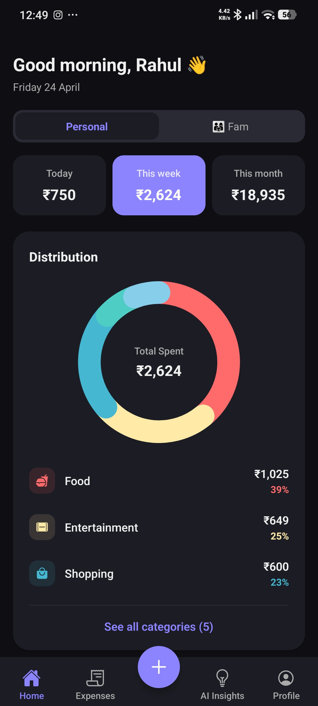
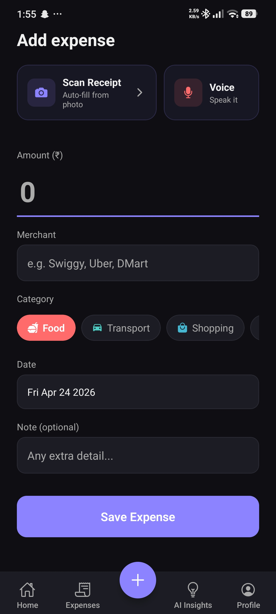
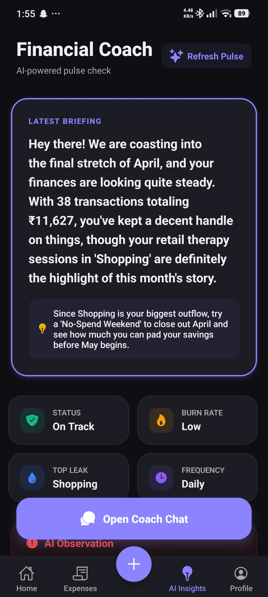
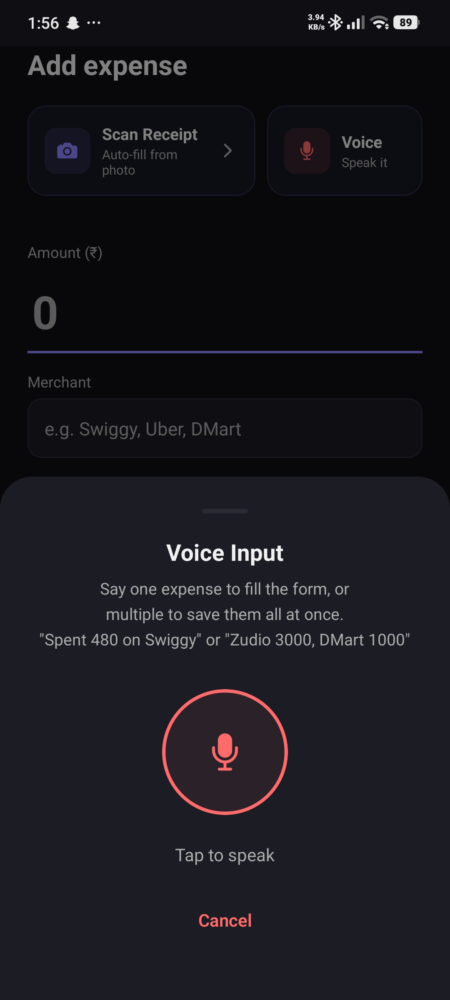
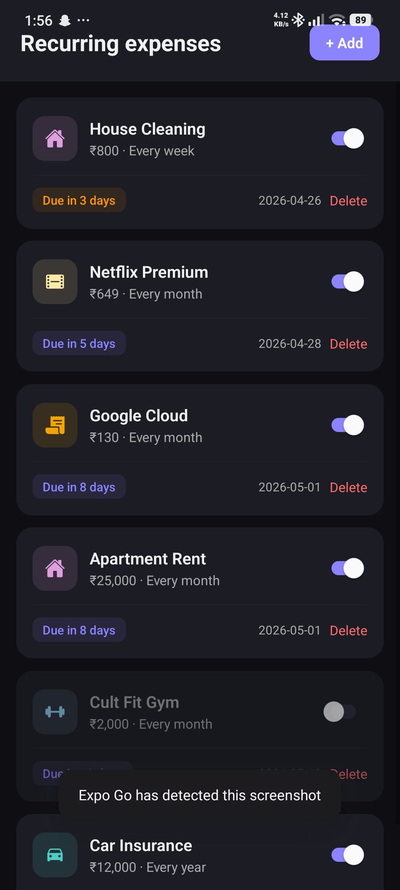

# 💸 Expensify: The Ultimate AI-Powered Financial Coach

A beautifully designed, feature-rich personal and family expense tracking app built with **React Native (Expo)**, **Native Kotlin Android Extensions**, and powered by **Supabase**. Expensify isn't just a ledger to record past transactions; it's a proactive financial assistant. It helps you log, visualize, and understand your spending habits via a premium user interface, AI-powered insights, voice input, receipt scanning, background SMS tracking, and collaborative family tracking.

---

## 🌟 Why Expensify? (The Value Proposition)

In a world full of basic budgeting apps, Expensify stands out by eliminating the friction of manual data entry and transforming raw numbers into actionable financial wisdom. 

**Why will people use it?**
1. **Automated Zero-Touch SMS Tracking:** Never forget to log an expense again. Expensify runs a native background engine that automatically detects bank debit SMS alerts in real-time — even when the app is completely closed or killed — and logs your expenses automatically.
2. **Frictionless Logging:** Hate typing out expenses? Tap the microphone and say, *"I spent 480 rupees on Swiggy for dinner."* The AI parses the amount, merchant, and category instantly. Have a receipt? Snap a picture and Gemini Vision extracts all the structured data for you.
3. **AI Financial Coach:** Most apps tell you *what* you spent. Expensify tells you *how to improve*. Our integrated Gemini AI acts as a personal financial advisor, analyzing your trends and suggesting real-time actionable insights to save money.
4. **Built for Modern Families:** Finances are often shared. Expensify allows you to seamlessly switch between a "Personal" view and a "Family Group" view. Spouses and family members can track communal spending perfectly organized by member contributions, synced in real-time.
5. **Premium Aesthetics:** Budgeting shouldn't feel like a chore. The application features a stunning glassmorphism design, harmonious dark mode, smooth micro-animations, and responsive feedback that makes tracking your money genuinely delightful.
6. **Your Data, Your Control:** Advanced filtering by timeline and robust CSV data exporting means your financial data isn't trapped in the app. You can extract it whenever you need to process it on your own terms.

---

## 📱 Screenshots & Features at a Glance

| Home Dashboard | Add Expense | AI Insights |
|:-:|:-:|:-:|
|  |  |  |
| Voice Input | Recurring Expenses | Family Group |
|:-:|:-:|:-:|
|  |  |  |

---

## ✨ Comprehensive Feature Matrix

### 1. 🏠 The Command Center (Home Dashboard)
- **Time-Period Stats:** Real-time visual cards for Today, This Week, and This Month totals.
- **Spending Pie Chart:** Immediate category breakdown for the selected period.
- **Daily Bar Chart:** Historical weekly spending trend to identify peak expenditure days.
- **Budget Card:** Visual progress bar tracking your speed against a dynamic monthly budget, with specific category-level limits.
- **AI Insight Card:** Your latest personalized AI-generated spending insight shown inline.
- **Recurring Nudge:** Priority alerts when your subscriptions or recurring expenses are due today.
- **Personal ↔ Family Toggle:** Instantly switch between personal and group spending when actively part of a family group.
- **Member Spending Bar:** See exactly how much each group member has contributed in the group view.

### 2. 📲 Automatic Background SMS Expense Sync (Zero-Touch)
- **Native Android Processing:** Operates directly via native Kotlin without needing Metro or active React Native runtime.
- **Android 14 & 15 Compatible:** Powered by a persistent `SmsForegroundService` and `WorkManager` to prevent OS process termination when swiped away from recents.
- **VPA Classification Engine:**
  - **Personal P2P:** Auto-saves with category `Personal` for 10-digit phone numbers and P2P bank handles (`oksbi`, `okaxis`, `ybl`, `paytm`, `ibl`, `apl`).
  - **Recognizable Brands:** Auto-saves brands (`swiggy`, `uber`, `zomato`, etc.) with `Other` / AI categorization.
  - **Dynamic QR Codes:** Automatically queries `merchant_mappings`. If mapped, auto-saves with friendly name. If unmapped, routes to **Pending Expenses** queue asking you to name the merchant.
- **Instant System Notifications:** High-priority native notification with deep-link navigation directly to regular or pending expense screens.

### 3. ➕ Frictionless Expense Input
- **Manual Form:** Clean UI with an AI category auto-suggest mapping categories dynamically to the merchant name you type.
- **Next-Gen Voice Input:** Tap the microphone and speak naturally: *"Took an Uber ride for 320 rupees."* Audio is securely parsed and the expense is automatically categorized and saved.
- **Bill/Receipt Scanner:** Snap a photo of your receipt; Gemini Vision natively extracts merchant, total, date, items, and category.
- **Granular Editing:** Fully edit transactions manually if AI misses the mark.

### 4. 🤖 Google Gemini AI Integrations
- **AI Chat Assistant (`/ai-bot`):** A conversational interface where you can ask anything about your spending history. (e.g. *"Did I spend too much on food this week?"*)
- **Insights Feed:** Lists all proactively generated insights (daily / weekly / monthly summaries) in reverse chronological order.
- **Smart Formatting:** Complete with typing indicators and conversational chips to jumpstart prompts.

### 5. 🔄 Subscription & Recurring Expenses
- Define daily / weekly / monthly / yearly recurring expenses (rent, Netflix, gym, EMIs).
- Toggle active/paused states universally per item.
- Adaptive due-date badges (overdue, due today, due in N days) directly notifying the home screen.

### 6. 👨‍👩‍👧 Seamless Family Groups
- Create a new group and share an auto-generated, secure 6-character invite code.
- Join an existing family group securely.
- Powered natively by Supabase Row Level Security (RLS) policies allowing for cross-member expense visibility without compromising personal database constraints.

### 7. 🗂️ Advanced Searching, Filtering & Exporting
- **Chronological List:** View fully detailed expense lists.
- **Real-Time Search:** Search natively by Merchant or Description.
- **Dynamic Timeline Filter:** An advanced Action Sheet categorizes and filters historical items natively by exact months or 'Older Expenses'.
- **Export to CSV:** Fully download and share your financial data to external applications with a tap on the profile screen.

### 8. 🌗 Theme System & Settings
- **Gorgeous UI:** Glassmorphism and modern gradient styling integrated directly into a responsive mobile layout.
- **Dark Mode Engine:** A completely flexible `useTheme()` engine dynamically handles styling tokens.
- **Customizable Budgets:** Set specific limits across your spending to track against.

---

## 🏗️ Architecture: Native Background SMS Sync Engine

To support background SMS tracking when the app is completely closed or killed on **Android 14 / 15**, the app uses a pure Native Kotlin engine embedded alongside React Native:

```
                  ┌─────────────────────────────────────┐
                  │       Incoming Bank SMS (Device)     │
                  └──────────────────┬──────────────────┘
                                     │
                                     ▼
                   ┌───────────────────────────────────┐
                   │  SmsReceiver (BroadcastReceiver)  │
                   └─────────────────┬─────────────────┘
                                     │
                                     ▼
                   ┌───────────────────────────────────┐
                   │       Android WorkManager         │
                   │           (SmsWorker)             │
                   └─────────────────┬─────────────────┘
                                     │
                                     ▼
                   ┌───────────────────────────────────┐
                   │        NativeSmsProcessor         │
                   │  - Regex Amount & VPA Extraction  │
                   │  - 30-min SharedPreferences Dedup │
                   │  - Read Cached User Session       │
                   └─────────────────┬─────────────────┘
                                     │
                 ┌───────────────────┴───────────────────┐
                 │                                       │
                 ▼                                       ▼
     [Personal / Brand / Mapped VPA]             [Unmapped Dynamic QR]
                 │                                       │
                 ▼                                       ▼
   POST /rest/v1/expenses                  POST /rest/v1/pending_sms_expenses
                 │                                       │
                 ▼                                       ▼
  System Notification:                    System Notification:
  "Expense Saved: ₹X at Merchant"         "New Expense Detected: Tap to Name"
```

### Key Components

- **`SmsForegroundService.kt`**: A persistent status service (`START_STICKY`) that prevents Android 14/15 from placing the app process into the `STOPPED` state when swiped away from recents.
- **`SmsReceiver.kt`**: Statically registered broadcast receiver listening for `android.provider.Telephony.SMS_RECEIVED`.
- **`SmsWorker.kt`**: Enqueued via Android `WorkManager` for guaranteed background execution with system WakeLock and network state management.
- **`NativeSmsProcessor.kt`**: Pure Kotlin class performing regex field extraction, VPA classification, SharedPreferences deduplication, SQLite/Preferences auth session retrieval, and direct Supabase REST API communication.
- **`plugins/withSmsReceiver.js`**: Expo Config Plugin that injects all native Kotlin source code, permissions, and dependencies automatically during `expo prebuild`.

---

## 🛠 Tech Stack

| Layer | Technology |
|---|---|
| **Frontend** | React Native + Expo (Router v3) |
| **Native Extensions** | Android Kotlin (Foreground Service, WorkManager, BroadcastReceiver) |
| **Backend & Auth** | Supabase (PostgreSQL, Edge Functions, Row Level Security, Google Auth) |
| **AI/ML** | Google Gemini API, Vision API, Speech-to-Text |
| **State & Data** | Zustand, React Query (TanStack Query) |

---

## ☁️ Supabase Edge Functions

All AI and heavy-lifting logic runs securely off-client using Deno-based Supabase Edge Functions:

| Function | Purpose |
|---|---|
| `categorize-expense` | Returns the best-matching spending category for a merchant |
| `parse-voice-expense` | Transcribes audio and extracts the structured expense payload |
| `scan-bill` | Receives a base64 receipt image, leveraging Gemini Vision to extract totals and context |
| `generate-insights` | Synthesizes daily/weekly/monthly summaries into the `insights` feed |
| `ai-assistant` | The brain behind the conversational Q&A interacting with your expense history |
| `send-notifications` | Dispatches push notifications for due tasks or warnings |

---

## 🚀 Getting Started

### Prerequisites

- Node.js ≥ 18
- Android Studio & SDK (for building native standalone APK)
- Supabase account & CLI
- Google Cloud Console account (for Gemini API, Vision API, and Speech-to-Text)
- Google OAuth Client ID (for Authentication)

### 1. Clone & install

```bash
git clone https://github.com/rxhuljoshi10/Expensify.git
cd Expensify
npm install
```

### 2. Configure environment variables

Create a `.env` file in the project root:

```env
EXPO_PUBLIC_SUPABASE_URL=https://<your-project>.supabase.co
EXPO_PUBLIC_SUPABASE_ANON_KEY=<your-anon-key>
EXPO_PUBLIC_GOOGLE_WEB_CLIENT_ID=<your-google-oauth-client-id>
```

Set the Google API keys as Supabase secrets for your Edge Functions:

```bash
supabase secrets set GEMINI_API_KEY=<your-gemini-key>
supabase secrets set GOOGLE_VISION_API_KEY=<your-vision-api-key>
supabase secrets set GOOGLE_SPEECH_API_KEY=<your-speech-api-key>
```

### 3. Deploy Edge Functions

```bash
supabase functions deploy categorize-expense
supabase functions deploy parse-voice-expense
supabase functions deploy scan-bill
supabase functions deploy generate-insights
supabase functions deploy ai-assistant
supabase functions deploy send-notifications
```

### 4. Build Standalone APK (With Native Background SMS Tracking)

To build the standalone release APK containing all native Kotlin SMS background code:

```bash
npx expo prebuild
cd android
.\gradlew.bat assembleRelease
```

The compiled APK will be located at:
`android/app/build/outputs/apk/release/app-release.apk`

---

## 📄 License & Attribution

This project is private and not currently licensed for public distribution.
